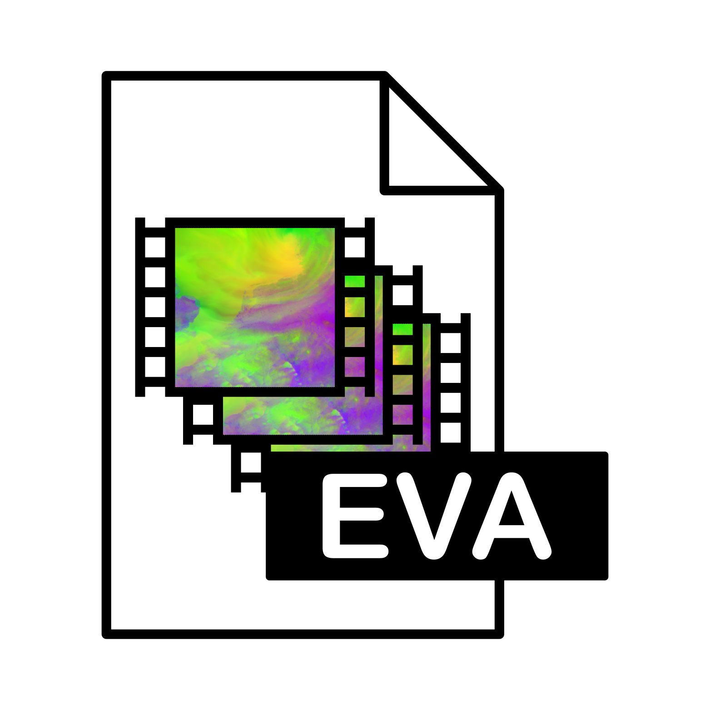

<!-- PROJECT LOGO -->
<div align="center">
    
</div>
<h3 align="center">EVA METOC</h3>
<p align="center">
Environmental Video Array - Making METOC data portable with video codecs
</p>
<p align="center">
<strong><a href="https://github.com/datalab-nld/eva">Explore the docs »</a> - <a href="#">Read the paper »</a></strong>
</p>

## About The Project
EVA METOC is a package to compress Numerical Weather Predictions and Ocean forecast into small files, using video codecs.

Numerical Weather Predictions and Ocean forecasts (METOC) are datasets with a large file size. Some users have limited bandwidth available and require much smaller file size that can be shared by email or satellite communications. Compression of the datasets can be a solution for these use cases. In this package, we provide tools to use common video codecs to make METOC data portable. Such codes are maintained for a very large user community and offer decompression in near-real time of small compressed datasets while preserving most of the important information.

## Build with

* [![python][python-img]][Python-url]
* [![xarray][xarray-img]][xarray-url]
* [![ffmpeg][ffmpeg-img]][ffmpeg-url]

## Getting started

### Installation

#### FFmpeg
Since `evametoc` depends on ffmpeg being available, firstly install [ffmpeg][ffmpeg-download]. 

```bash
$ sudo apt update
$ sudo apt install ffmpeg
```
(For other platforms, please check the [ffmpeg][ffmpeg-download] page. Make sure the `ffmpeg` command is available in you PATH.)

#### Clone the repo

```bash
$ git clone https://github.com/datalab-nld/eva.git
```

#### Prerequisites
Then install the required packages using `conda`, `mamba` or `pip`

```bash
$ mamba create -n evametoc
$ mamba activate evametoc
$ mamba install --file requirements.txt
```

#### Installation

Lastly install this package
```bash
$ python setup.py install 
```

## Usage

To encode a netcdf file with `evametoc`, use the `main_encode` function.

```python
import evametoc
import os

filename = "./HARM43_V1_P1.nc4"
current_filesize = os.stat(filename).st_size

evametoc.main_encode(
    dataset_path = filename
    file_size = int(current_filesize // 100),
    target_path = "HARM43_V1_P1.eva"
    dataset_type = 'harm40',
    nan_lossless = True
)
```

After transfering the `.eva`-file to the target platform, you can decompress the data with the `main_decode` function.

```python
import evametoc

evametoc.main_decode(
    eva_path = "./HARM43_V1_P1.eva",
    target_path = "HARM43_V1_P1_transfer.nc4"
)
```

_For more examples, please refer to the [Documentation][docs-url]_

## License

Distributed under the EUROPEAN UNION PUBLIC LICENCE v. 1.2. See `LICENSE` for more information.

<!-- MARKDOWN LINKS & IMAGES -->
[docs-url]: https://github.com/datalab-nld/eva
[paper-url]: https://github.com/datalab-nld/eva
[python-url]: https://www.python.org/
[python-img]: https://img.shields.io/badge/Python-3670A0?style=for-the-badge&logo=python&logoColor=ffdd54
[xarray-url]: https://docs.xarray.dev/en/stable/
[xarray-img]: https://img.shields.io/badge/xarray-4ACFDD?style=for-the-badge&logo=numpy&logoColor=e38017
[ffmpeg-url]: https://ffmpeg.org/
[ffmpeg-img]: https://img.shields.io/badge/FFmpeg-000000?style=for-the-badge&logo=FFmpeg&logoColor=5cb85c
[ffmpeg-download]: https://ffmpeg.org/download.html